# 项目流程图

## 核心逻辑图

读图说明：从左到右看一次对局如何启动、接收输入、修改状态、推进模拟并输出画面。蓝图中的每个节点都对应当前 `app.js` 中的真实职责，不表示新架构。

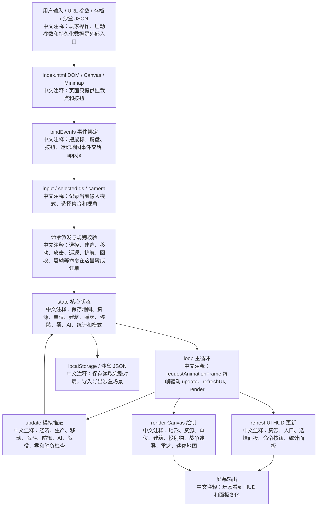

## 每帧执行流

读图说明：这张图只描述 `loop(now)` 和 `update(dt)` 的执行顺序。排查性能、暂停、沙盒冻结、战斗结算问题时优先看它。

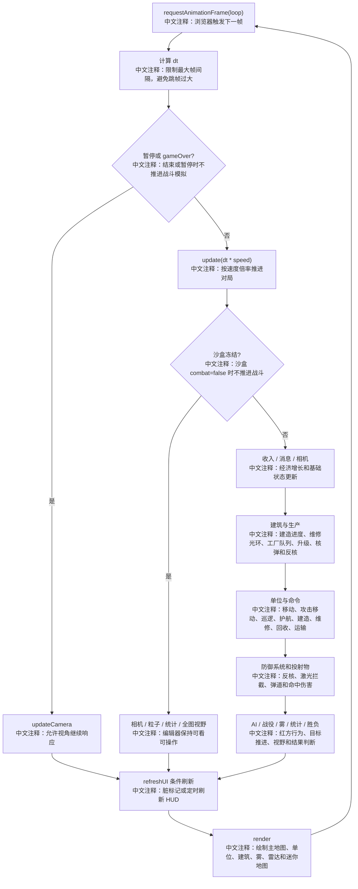

## 原生 iOS 迁移地基流程图

读图说明：这张图描述 v1.0 新增的原生 iOS 首屏链路。它只表示迁移地基，不表示 Web 版完整 RTS 已迁移完成。

```mermaid
flowchart TD
  P["RustwarCore MapPreset<br/>中文注释：三张地图的基础坐标、资源和初始单位建筑"] --> S["GameState<br/>中文注释：Swift 原生状态快照，包含资源、单位、建筑、残骸、金属和选择"]
  S --> E["GameEngine.update / GameState.visibility(for:) / select(mutation:) / selectVisibleToPlayer(mutation:) / selectIdlePlayerBuilders / selectPlayerCombatUnits / selectPlayerCombatUnits(in:mutation:) / selectPlayerUnits(in:mutation:) / selectPlayerEntities(in:mutation:) / selectPlayerUnitsMatchingPrimarySelection(mutation:) / selectPlayerUnitsMatching(unitID:within:mutation:) / storeControlGroup / recallControlGroup / issueMove / issueAttackMove / issuePatrol / issueGuard / setAttackStance / issueRepair / issueReclaim / issueBuildExtractor / issueBuildTurret / issueBuildLandFactory / issueStop / issueAttack / queueUnit / queueBuildingUpgrade / cancelBuildingUpgrade / cancelLastProduction / setRepeatProduction / setRally / setEnemyAIEnabled / init(state)<br/>中文注释：推进收入 tick、按单位/建筑有效 vision 计算玩家当前可见 tile、点选、玩家可见敌方过滤点选、多选集合、选择替换/追加、世界矩形框选、区域选择建筑 fallback、屏幕范围作战单位选择、全图同类型选择、附近同类型选择、控制编队保存/召回、空闲 Builder/战斗单位批量选择、单单位和多单位移动、单单位和多单位攻击、单单位和多单位攻击移动、单单位和多单位巡逻、单单位和多单位护航；Move、Attack-Move 和 Patrol 多选点位命令共用稳定方阵落点，Guard 多选目标命令使用稳定方阵护航偏移，Repair、Reclaim 和 Build 多 Builder 更新时使用动态分散接近点；攻击姿态切换、单 Builder 和多 Builder 维修、单 Builder 和多 Builder 回收、单 Builder 和多 Builder 建造 Extractor、单 Builder 和多 Builder 建造 Turret、单 Builder 和多 Builder 建造 Land Factory、玩家 Radar Station T2 升级和取消、玩家 Extractor T2/T3 升级和取消、停止、炮塔防御开火、死亡残骸、生产建筑队列、生产取消、重复生产、集结点、红方 AI 开关、红方资源扩张/维修/回收/建造 Land Factory/建造 Turret/建造 Radar Station/升级 Radar Station/升级 Extractor/生产/进攻 AI 和存档状态恢复"]
  E --> C["GameController @Observable<br/>中文注释：持有 engine、camera、当前地图、HUD、暂停/速度、Enemy AI 开关、Replace/Add 选择模式、批量选择入口、Select Area 单位优先框选和建筑 fallback 等待态、Screen Combat 当前屏幕作战单位选择、Same Type 全图同类型选择、双击附近同类型选择、控制编队保存/召回、移动命令、攻击、攻击移动、护航、维修、回收、建造、生产、生产取消、重复生产、集结点和 Save/Load 入口；Move/Attack/Attack Move/Patrol/Guard/Repair/Reclaim/Build Extractor/Stop 复用多选集合"]
  C --> LAY["RootGameView geometry -> TacticalHUDLayoutMetrics<br/>中文注释：一次集中计算三档 role、dock 和 Tactical Map 尺寸；先把高度 <520 的横屏识别为 compact trailing，短横屏 dock 为 224-260pt 单列"]
  C --> FB["Explicit feedback revisions<br/>中文注释：离散选择、成功 enum case、拒绝/失败分别递增 selection / success / warning；帧循环和连续相机输入不触发"]
  FB --> SF["SwiftUI sensoryFeedback<br/>中文注释：RootGameView 使用系统 selection / success / warning 反馈，不使用 UIKit generator 或文本解析"]
  C --> CF["CommandConfirmation(kind, WorldPoint, revision)<br/>中文注释：仅成功的世界坐标命令发布，失败和无坐标操作不发布"]
  CF --> CM["Bounded command marker under fog<br/>中文注释：当前真实可见才生成，类型化颜色/符号、逆 zoom 稳定尺寸，Reduce Motion 只淡出"]
  CF --> TMP["Short Tactical Map command pulse<br/>中文注释：复用同一事件和共享调色板；revision task 按 monotonic age 动画/过期，不永久刷新 Canvas"]
  LAY --> H["GameHUD presentation dispatcher + TacticalHUDTheme<br/>中文注释：分派独立 StatusBar / CommandDock；共享 spacing/radius/hit-target/status tokens，Selection Summary 只读派生文本，六个 section 各自拥有本域 action、快捷键与 VoiceOver"]
  LAY --> TM["Reserved TacticalMapView region<br/>中文注释：只放在 Battlefield 自身区域，按 176x118、144x96 或 120x80 缩放，与顶栏和 dock frame 不相交；原手势和世界换算不变"]
  LAY --> B["SpriteView + BattlefieldScene snapshot reader<br/>中文注释：只读 Core 快照，维护 scene-only heading / cooldown / HP / entity-id 历史；当前 HP 还派生受损烟柱/危急火焰，每实体最多两个额外 path 节点，不回写玩法状态"]
  CI["GitHub Actions iPhone 17 Pro / iOS 26.5 Simulator<br/>中文注释：按真实 UDID 构建、安装，并分别启动生产与战斗视觉场景"] --> SHOT["双 PNG + ImageIO metrics gate<br/>中文注释：ios-home / ios-combat 分别校验尺寸、透明比例和亮度变化，拒绝空图或近似黑屏"]
  SHOT --> ART["v1.2 CI artifact<br/>中文注释：保存 manifest、8 项 JUnit、日志、simulator info、双 PNG 和小型 metrics，不上传 DerivedData"]
  T["SpatialTap / LongPress / Drag / Magnify<br/>中文注释：iOS 触摸选择、移动落点、长按上下文命令、Select Area 框选、拖拽平移和捏合缩放"] --> DT["Battlefield tap router<br/>中文注释：pending 优先；无等待时友方选择、可见敌方 Attack、空地 Attack Move"]
  DT --> C
  TT["TacticalMap DragTap / DragCamera / LongPress<br/>中文注释：点按小地图换算世界坐标；等待点位、Builder 目标或实体目标命令时显示反馈并下令，否则点按居中相机、拖动连续移动相机；无等待命令时长按复用上下文命令"] --> C
  CTX["Battlefield long press context command<br/>中文注释：非等待态长按主战场，按敌方 Attack、受损友方 Repair、健康友方 Guard、残骸 Reclaim、资源点 Build Extractor、空点 Rally 或 Move 的顺序复用已有命令"] --> C
  C --> M["UnitOrder.move<br/>中文注释：选中己方单位后写入移动目标；多选时按稳定方阵给选中己方单位分配围绕目标点的目的地"]
  M --> E
  C --> AS["WorldRect area selection<br/>中文注释：Select Area 等待态中主战场拖拽显示 SwiftUI 选择框，松手后用屏幕两端点换算世界矩形；先选框内己方单位，若没有单位再按建筑 bounds fallback 选择己方建筑"]
  AS --> E
  C --> SM["SelectionMutation Replace/Add<br/>中文注释：Replace 替换当前选择；Add 追加命中的存活己方实体，空点或空框保留旧选择"]
  SM --> E
  C --> STS["Same Type selection<br/>中文注释：选中己方单位后，一键选择全图所有同类型己方单位，结果写入多选集合"]
  STS --> E
  C --> SCS["Screen Combat selection<br/>中文注释：BattlefieldView 同步 viewport，CameraState 换算可见世界矩形，HUD 或外接键盘 F 选择当前屏幕内己方非 Builder 作战单位"]
  SCS --> E
  C --> DTS["Double-tap nearby same type<br/>中文注释：普通选择状态下连续点按同一个存活己方单位，选择半径内同类型己方单位；等待命令时不触发"]
  DTS --> E
  KBD["External Keyboard 1-9<br/>中文注释：Control+数字触发 Save，裸数字触发 Recall，复用 HUD 按钮 action 和 disabled 条件"] --> C
  KBT["External Keyboard tactical shortcuts<br/>中文注释：P/R/E/F/Ctrl+A/Option+A/A/G/H/C/S/Z/X/V 复用现有 HUD 按钮 action、条件渲染和 disabled 状态"]
  KBT --> C
  KBP["External Keyboard production/build shortcuts<br/>中文注释：Shift+1-9 按当前 productionOptions 顺序生产；Shift+E/T/F/D 进入建造等待态；Shift+C/P/R 复用取消生产、重复生产和集结点按钮"]
  KBP --> C
  KBC["External Keyboard camera pan<br/>中文注释：RootGameView 捕捉 WASD / 方向键 down-repeat-up，GameController 每帧按方向集合推进 CameraState"]
  KBC --> C
  FB["Focus Base / Space<br/>中文注释：HUD Base 或外接键盘 Space 查找存活己方 Command Center 并复用相机居中 clamp"]
  FB --> C
  C --> CG["Control Groups 1-9 HUD + Keyboard<br/>中文注释：Save 保存当前有效己方选择，Recall 召回并过滤仍有效己方单位或建筑，结果写入多选集合"]
  CG --> E
  C --> AM["UnitOrder.attackMove<br/>中文注释：选中己方单位后写入攻击移动目的地；多选时按与 Move 相同的稳定方阵获得围绕目标点的分散目的地，core 在视野内临时索敌"]
  AM --> E
  C --> PT["UnitOrder.patrol<br/>中文注释：选中己方单位后写入巡逻两端点；多选时各自当前位置为起点，并按与 Move 相同的稳定方阵获得围绕目标点的分散端点，core 在视野内临时索敌并在端点间往返"]
  PT --> E
  C --> GD["UnitOrder.guardTarget<br/>中文注释：选中己方单位后点选友方单位或建筑；多选时所有选中己方单位护航同一目标，并按稳定方阵保存围绕目标的分散 offset，core 在自身视野或被护航目标附近临时索敌并返回稳定护航点"]
  GD --> E
  C --> US["UnitAttackStance<br/>中文注释：HUD Aggressive / Defensive / Hold Fire 和外接键盘 Z/X/V 调用 setAttackStance；core 在 Attack-Move、Patrol、Guard 临时索敌时按姿态缩放自动接敌范围，Hold Fire 跳过自动索敌但不阻止手动 Attack"]
  US --> E
  C --> REP["UnitOrder.repair<br/>中文注释：选中己方 Builder 后点选受损友方单位或建筑；多选 Builder 时所有选中己方 Builder 维修同一目标，目标自身被跳过，core 在远距时动态分散接近目标周边，进入 125 范围后按 18 HP/s 维修"]
  REP --> E
  C --> REC["UnitOrder.reclaim<br/>中文注释：选中己方 Builder 后点选残骸，多选 Builder 时所有选中己方 Builder 回收同一有效残骸；core 在远距时动态分散接近残骸周边，进入 92 范围后把残骸金属转为己方金属"]
  REC --> E
  C --> BLD["UnitOrder.build<br/>中文注释：选中己方 Builder 后点选空闲资源点，多选 Builder 时只创建一个 Extractor 且所有选中己方 Builder 协同建造同一目标；core 在远距时动态分散接近建筑周边"]
  BLD --> E
  C --> TBT["UnitOrder.build / Turret<br/>中文注释：选中己方 Builder 后点选清晰陆地点，多选 Builder 时只创建一个 Turret 且所有选中己方 Builder 协同建造同一目标；core 在远距时动态分散接近建筑周边，完成后自动防御开火"]
  TBT --> E
  C --> BFT["UnitOrder.build / Land Factory<br/>中文注释：选中己方 Builder 后点选清晰陆地点，多选 Builder 时只创建一个 Land Factory 且所有选中己方 Builder 协同建造同一目标；core 在远距时动态分散接近建筑周边，完成后接入生产体系"]
  BFT --> E
  C --> STP["issueStop<br/>中文注释：选中己方单位后清除当前订单；多选时清除所有选中己方单位的移动、攻击移动、巡逻、护航、维修、回收、建造或攻击订单"]
  STP --> E
  C --> A["UnitOrder.attack<br/>中文注释：选中己方单位后点选敌方目标，多选时所有选中己方单位攻击同一敌方单位或建筑，core 推进靠近、伤害和死亡清理"]
  A --> E
  C --> Q["ProductionQueueItem<br/>中文注释：选中己方 Command Center 后可排队 Builder，选中己方 Land Factory 后可排队 Scout、Light Tank、Hover Tank、Artillery 或 AA Tank；队列完成并清空时可按 repeatUnitType 自动尝试续造"]
  Q --> E
  C --> UPG["BuildingUpgradeResult / BuildingUpgradeCancelResult / BuildingSnapshot.upgradeLevel / upgradeProgress<br/>中文注释：选中完成状态己方 Radar Station 或 Extractor 且金属足够时，Upgrade 扣除金属并启动下一等级进度；Cancel Upgrade 可取消当前进度并按剩余进度退款；GameEngine.update 推进升级，Radar T2 提高 HP 上限、vision 和 radarRange，Extractor T2/T3 提高 HP 上限、income 和 vision"]
  UPG --> E
  C --> CQ["ProductionCancelResult<br/>中文注释：选中己方生产建筑后取消队尾生产并按未完成进度退款"]
  CQ --> E
  C --> RPT["ProductionRepeatResult / BuildingSnapshot.repeatUnitType<br/>中文注释：选中己方生产建筑后在当前生产列表内循环 Repeat 目标，状态随 GameState 存档"]
  RPT --> E
  C --> RP["BuildingSnapshot.rally<br/>中文注释：选中己方生产建筑后设置后续出兵集结点"]
  RP --> E
  C --> PS["Pause / Speed Gate<br/>中文注释：暂停时不调用 update，运行时按 0.5x / 1x / 2x 缩放 deltaTime"]
  PS --> E
  C --> EA["Enemy AI On/Off<br/>中文注释：HUD 按钮调用 setEnemyAIEnabled，仅切换红方新 AI 决策，Save/Load 保存恢复该 flag"]
  EA --> E
  C --> MP["Map Switch / Restart<br/>中文注释：重建 GameEngine、重置相机、清空待选命令并刷新地图渲染层"]
  MP --> E
  C --> SL["UserDefaults Save / Load<br/>中文注释：JSON 保存 GameState、CameraState、地图、暂停、速度和 AI 开关，读取后刷新原生状态"]
  SL --> E
  C --> VIS["VisibilitySnapshot fog / RadarContactSnapshot signal / RadarCoverageSnapshot ranges / enemy filtering<br/>中文注释：根据存活己方单位和完成己方建筑有效 vision 计算当前可见 tile，并把当前可见 tile 合并进 GameState explored 记忆；完成状态 Radar Station 的有效 radarRange 生成不可见敌方雷达信号点和只读覆盖 snapshot，但不写入可见 tile 或 explored，Command Center 不再是雷达来源；v1.80 起红方 AI 在基础经济、工厂和炮塔成型后会建造 1 座 Radar Station；v1.81 起 HUD 和 VoiceOver 汇总玩家雷达站/contact 数量，主战场选中完成玩家 Radar Station 时绘制覆盖圈，战术小地图绘制玩家雷达覆盖范围；v1.82 起 T2 Radar Station 扩大 vision、radarRange、coverage 和 contact 范围，HUD VoiceOver 汇总已升级雷达数量；SpriteKit 主战场和 SwiftUI 战术小地图用浅雾覆盖已探索但当前不可见 tile、用深雾覆盖从未探索 tile，并隐藏当前视野外敌方真实单位/建筑及主战场不可见目标线；主战场 tap、长按上下文命令、Attack/Guard/Repair 等待态、战术小地图实体目标命中和战术小地图长按上下文命令过滤雾外敌方；暂不实现雾内敌方残影"]
  VIS --> B
  C --> FC["Camera focus Command Center<br/>中文注释：focusPlayerCommandCenter 只移动 camera.center，不改变 zoom、选择、等待态或单位命令"]
  FC --> B
  C --> KP["Camera keyboard pan<br/>中文注释：WASD / 方向键只移动 camera.center，斜向归一化并 clamp 到地图边界"]
  KP --> B
  C --> VM["Tactical map viewport frame<br/>中文注释：GameController 根据 CameraState 和主战场 viewport size 暴露当前可见 WorldRect，TacticalMapView 绘制小地图白色视口框"]
  VM --> TM
  C --> TMC["Tactical map camera drag<br/>中文注释：无等待命令时，小地图拖动超过阈值后调用 dragTacticalMapCamera，只移动 CameraState.center 并让视口框跟随更新"]
  TMC --> TM
  E --> TF["Turret Fire<br/>中文注释：完成状态炮塔自动攻击射程内敌方单位或建筑并进入冷却"]
  TF --> E
  E --> AI["Enemy AI<br/>中文注释：红方 Builder 维修受损友军、扩张资源点、建造 Land Factory / Turret / Radar Station 并回收附近残骸，红方完成状态 Command Center 可排队 Builder，Land Factory 按完整 T1 列表排队造兵，空闲战斗单位按 Web-lite 评分获得攻击玩家目标的订单"]
  AI --> AIUP["Enemy Building Upgrades<br/>中文注释：v1.83 起红方 AI 在经济、Land Factory、Turret 和完成状态 Radar Station 都就绪且金属足够时，复用建筑升级 helper 排队 Radar Station T2；v1.87 起若雷达升级没有立即目标且保留一个 Extractor 建造费用缓冲，则排队红方 Extractor T2/T3，并让同 tick 后续生产继续保留该缓冲"]
  AIUP --> E
  AI --> E
  C --> E
  B --> TERR["Aggregated procedural terrain<br/>中文注释：TerrainGrid 按每种地形统一基础 path 聚合，grass/grass2 共享连续表现 family，并叠加低对比跨格材质 path 与海岸/深水/熔岩边界；只在地图重建时生成，位于雾下"]
  TERR --> PV["Procedural entity visuals<br/>中文注释：7 类单位和 5 类建筑使用复合几何剪影、局部队伍标识、朝向、施工框架和升级结构，不使用实体字母占位"]
  PV --> FX["Bounded layered combat effects<br/>中文注释：cooldown / HP / entity-id 差分触发武器差异弹道、受击/摧毁爆炸、烟尘；瞬态容器最多 64 个"]
  FX --> DEC["Bounded scorch decal layer<br/>中文注释：可见摧毁在实体下留下最多 32 个短寿命灼痕；地图 reset 清空"]
  DEC --> FOG["Current / explored fog overlay<br/>中文注释：effect/decal 位于雾下，不可见敌方不会泄漏真实剪影、精确 tracer、死亡或攻击关系；Reduce Motion 只保留 opacity 反馈"]
  FOG --> RR["Radar signal overlay<br/>中文注释：雷达 contact 仍只在雾上显示青色信号点和覆盖圈，不升级为真实敌方模型"]
  RR --> O["原生 iOS 战场画面<br/>中文注释：不是 WKWebView，不加载 index.html，显示聚合程序化地形、程序化实体、血条、建造/升级进度、短战斗反馈、残骸、订单线、战争迷雾和红方行动"]
  H --> O
  TM --> O
```

## Agent 迭代流程图

读图说明：这张图描述后续开发管理流程。普通单轮仍可由人工直接召唤 Agent A/B/C；未来人工也可以用 `agentx:` 给 Agent X 一个总目标，由 Agent X 拆分轮次并循环调度 Agent A -> Agent B -> Agent C。无论是否由 Agent X 主控，每轮通过都必须基于 `origin/main` 最新 GitHub Actions artifact。

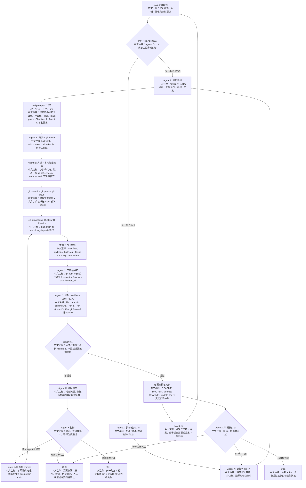

## CI 结果包流程图

读图说明：这张图只描述云端 workflow 如何生成 Agent C 可复判的 artifact。Web 原型仍无构建链；v1.0 起云端重验证除差异空白和 `app.js` 语法检查外，也记录 Swift package 与 iOS build 检查结果。未来可追加浏览器自动化报告。

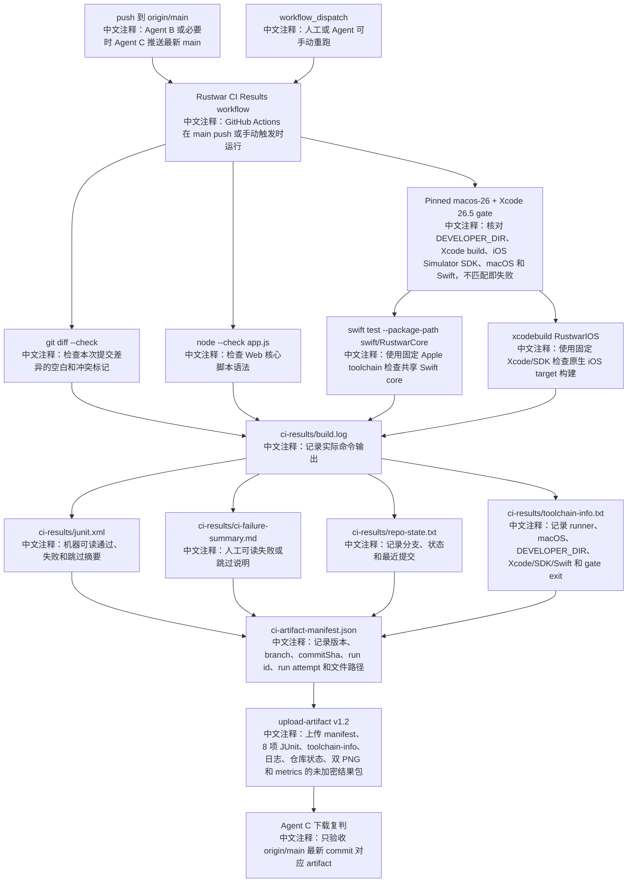

## v2.2 战术对比与 letterbox

读图说明：v2.2 不改命令流，只改 HUD 颜色 token 和相机 viewport 适配。

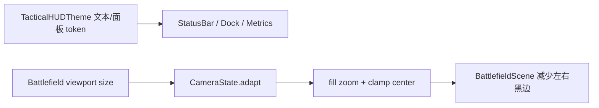

## v2.3 战术 control style

读图说明：v2.3 只替换按钮视觉样式，不改命令流。

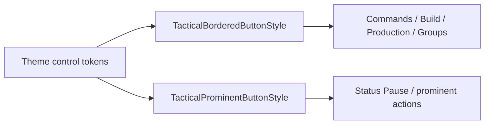

## v2.4 战术 picker

读图说明：v2.4 只包装 picker 外壳，不改选项绑定。

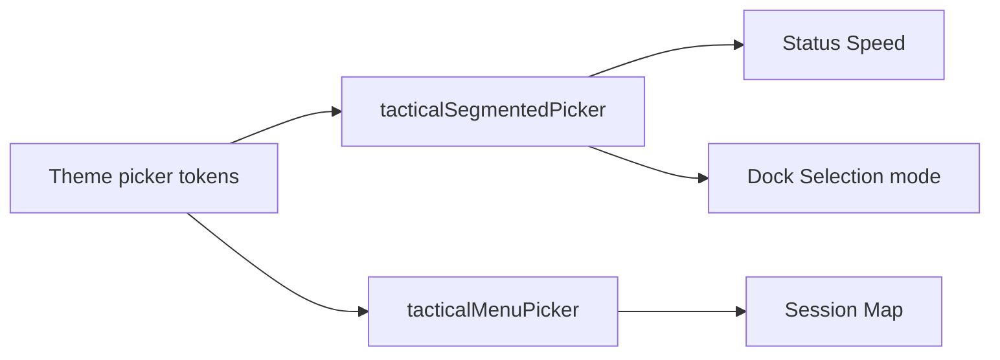

## v2.5 等待命令状态

读图说明：v2.5 只强化 waiting 视觉，不改命令状态字符串。

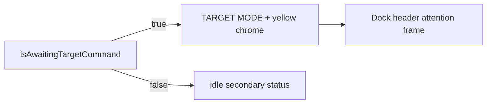

## v2.6 命令确认对比

读图说明：v2.6 只增强确认标记像素对比，不改事件流。

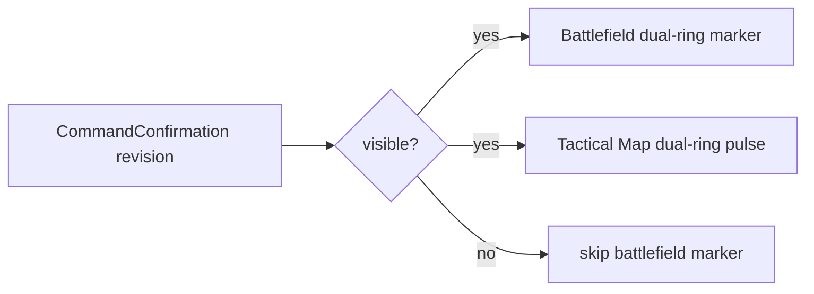

## v2.7 战术小地图 pending chrome

读图说明：v2.7 只改小地图等待态外壳，不改命令目标选择。

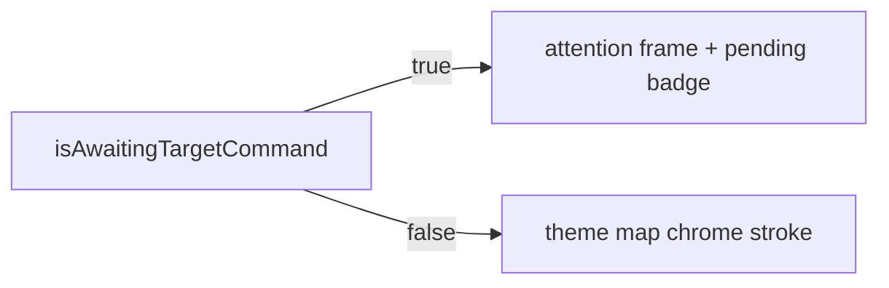

## v2.8 选中高亮对比

读图说明：v2.8 只增强选中高亮像素，不改选择状态流。

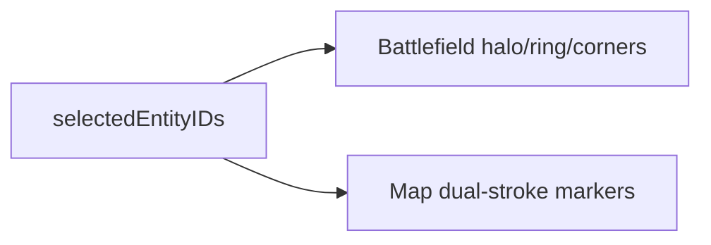

## v2.9 订单线与生命条对比

读图说明：v2.9 只增强 Scene 对既有订单与 HP 快照的只读绘制，不改变 Core 状态流。

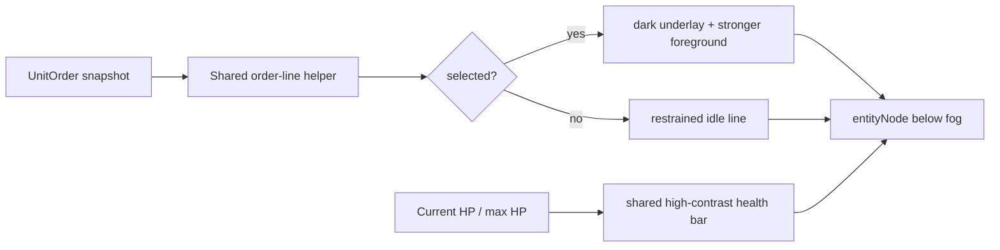

## v2.10 横屏状态栏资源可见性

读图说明：v2.10 只调整 prominent control 的容器宽度策略，不改变资源、暂停或速度状态流。

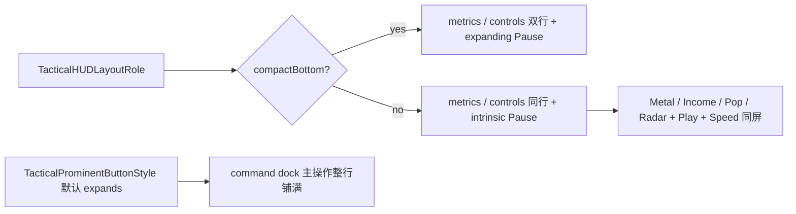

## v2.11 主战场直接点按命令

读图说明：v2.11 只调整 `GameController` 的无等待态 tap 决策，Core 命令、长按上下文和显式命令模式不变。

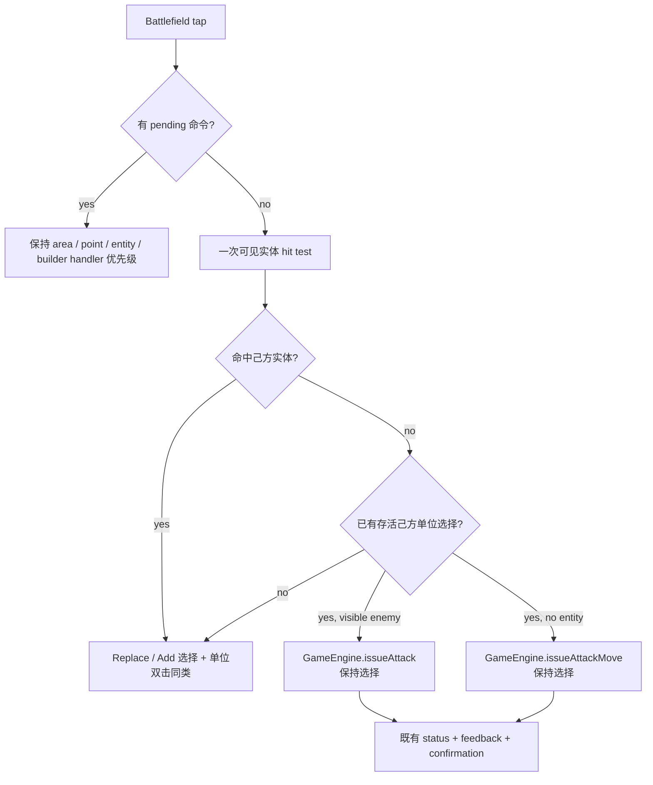

## v2.12 双指框选与捏合仲裁

读图说明：`SpatialEventGesture` 只负责识别双指意图；选择仍由既有 Core 世界矩形 API 执行，缩放仍由 `MagnifyGesture` 执行。

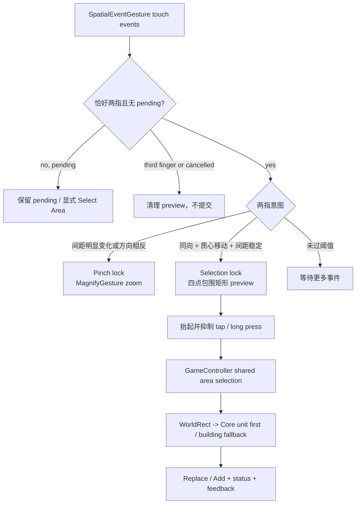

## v2.13 建筑操作优先级

读图说明：dock 顺序只由现有选择派生，不新增建筑命令或玩法状态。

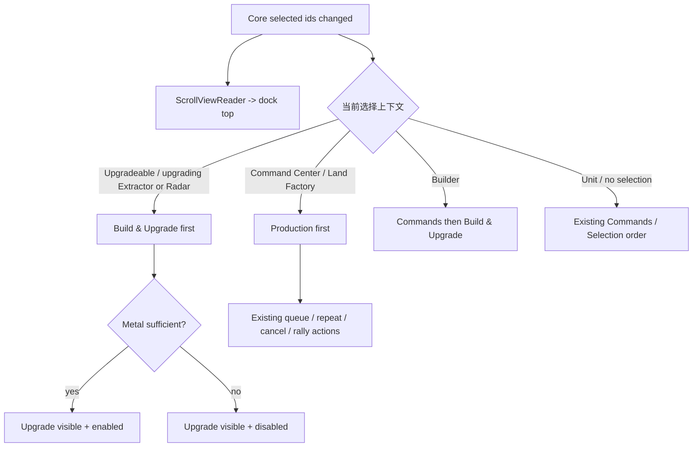

## v2.14 生产详情与云端建筑首屏

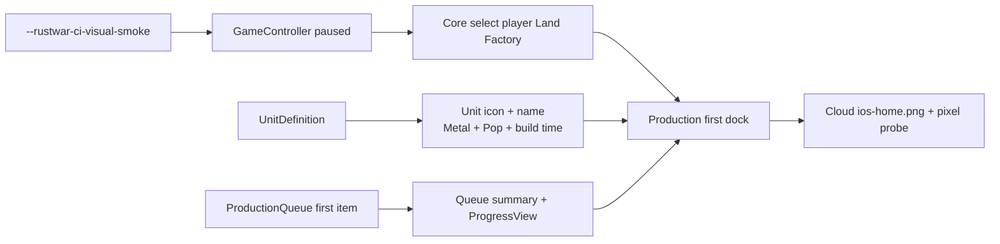

## v2.21 完整生产队列轨道

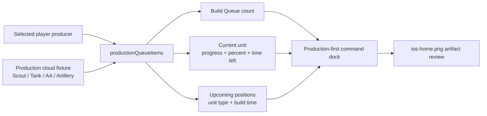

## v2.22 Land Factory T2

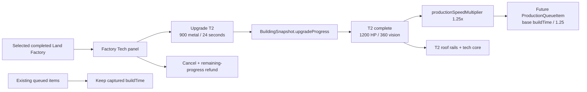

## v2.23 Heavy Tank T2 unlock

```mermaid
flowchart LR
  F["Selected completed Land Factory"] --> A["productionUnits(for: producer)"]
  D["UnitDefinition.requiredProducerUpgradeLevel"] --> A
  A --> T1["T1: five existing units"]
  A --> T2["T2: existing units + Heavy Tank"]
  T2 --> Q["Queue / Repeat / enemy candidate gate"]
  Q --> B["11.2s captured buildTime at 1.25x"]
  H["Heavy Tank Core snapshot"] --> M["Wide tracks + layered armor + low turret"]
  H --> C["Slow traverse + heavy recoil + long tracer"]
  M --> PNG["Production + combat cloud PNG evidence"]
  C --> PNG
```

## v2.24 Enemy Factory T2 progression

```mermaid
flowchart LR
  A["updateEnemyAI"] --> R["Radar T2 complete"]
  R --> E["At least one Extractor T2"]
  E --> F["Completed T1 enemy Factory candidate"]
  F --> M["900 metal + 260 reserve"]
  M --> U["Generic building upgrade: 24s"]
  U --> T["Factory T2"]
  T --> G["productionUnits(for:) tech gate"]
  G --> H["Heavy Tank joins least-count composition"]
```

## v2.25 Production dock hierarchy

```mermaid
flowchart LR
  S["Selected completed producer"] --> T["Factory Tech status strip"]
  T --> I["Icon + indivisible T1/T2 + speed"]
  T --> B["Ready / upgrading / max badge"]
  W["Available dock width"] --> H["Horizontal header or vertical fallback"]
  Q["Core ProductionQueueItem array"] --> C["Full-width current item"]
  C --> P["Percent + remaining time + ProgressView"]
  Q --> N["Compact ordered next slots"]
  O["Tech-gated productionOptions"] --> G["Icon + name + metal / supply / time"]
```

## v2.26 Direct production palette

```mermaid
flowchart LR
  S["Select completed producer"] --> T["Factory Tech"]
  T --> O["Tech-gated productionOptions"]
  D["Default Dynamic Type"] --> M["Three-column compact matrix"]
  A["Accessibility Dynamic Type"] --> F["One-column full labels"]
  O --> M
  O --> F
  M --> Q["Existing active item + ordered queue"]
  F --> Q
  Q --> C["Cancel / Repeat / Rally"]
```

## v2.27 Selection marker hierarchy

```mermaid
flowchart LR
  S["selectedEntityIDs"] --> A["All selected markers"]
  P["selectedEntityID or first fallback"] --> R["Primary marker"]
  A --> G["Player secondary: green short arcs"]
  R --> C["Player primary: cyan arcs + halo + ticks"]
  E["Enemy observation selection"] --> O["Orange primary / red secondary"]
  C --> Z["z -1 between shadow and model"]
  G --> Z
  O --> Z
  Z --> V["Hull / turret / effects stay readable"]
```

## v2.28 Industrial resource deposits

```mermaid
flowchart LR
  R["ResourceNode position / radius / claimedBy"] --> D["BattlefieldScene drawResources"]
  D --> P["Dark plate + inset + ground shadow"]
  D --> E["Eight-segment energy ring + four guides"]
  D --> C["Hex core + deterministic metal seams"]
  U["Unclaimed"] --> Y["Cyan high-contrast scan state"]
  O["Claimed"] --> F["Yellow subdued state below Extractor"]
  P --> Z["resourceNode below entities and fog"]
  E --> Z
  C --> Z
  Y --> Z
  F --> Z
```

## v2.29 Screen-space touch targets

```mermaid
flowchart LR
  S["44pt minimum touch diameter"] --> R["22pt radius / camera zoom"]
  R --> M["Core minimumHitRadius"]
  M --> T["Battlefield tap selection / Attack"]
  M --> C["Battlefield context long press"]
  M --> P["Attack / Guard / Repair pending target"]
  T --> N["Nearest entity center"]
  C --> N
  P --> N
  V["Player true visibility"] --> N
  F["Radar-only / unseen enemy"] --> X["Not targetable"]
  D["Default Core and Tactical Map"] --> O["Existing world-space radius"]
```

## v2.30 Multitouch intent tolerance

```mermaid
flowchart TD
  P["Two active touches"] --> C["Core MultitouchIntentClassifier"]
  C --> Z{"Distance change >= 12pt or opposed?"}
  Z -->|yes| M["Pinch lock -> MagnifyGesture"]
  Z -->|no| A{"Aligned centroid >= 8pt<br/>leader >= 10pt / follower >= 5pt?"}
  A -->|yes, no pending| S["Selection lock + box preview"]
  A -->|no| U["Undecided"]
  S --> R["Existing WorldRect Replace/Add selection"]
```

## v2.31 Dense unit tap cycling

```mermaid
flowchart LR
  P["Battlefield tap + 44pt world radius"] --> C["Visible ranked hit candidates"]
  C --> D{"Player-unit candidates unchanged?"}
  D -->|"<= 0.32s"| S["Nearby same-type selection"]
  D -->|"0.38...1.4s + same 44pt region"| N["Next stable candidate ID"]
  N --> I["GameEngine.select(entityID:)"]
  D -->|"Changed / expired"| F["Nearest target selection"]
  E["Enemy target / empty ground"] --> A["Attack / Attack Move unchanged"]
  M["Command / area / reset / load"] --> X["Clear transient cycle state"]
```

## v2.32 Friendly entity tap cycling

```mermaid
flowchart LR
  C["Visible ranked candidates"] --> F["Live friendly units + buildings"]
  F --> R["RepeatTapCycleResolver"]
  P["Previous IDs / entity / elapsed / screen distance"] --> R
  R -->|"valid 0.38...1.4s and <=44pt"| N["Next ID with wrap"]
  N --> S["Exact Replace/Add selection"]
  S --> U["Unit controls or building Production / Upgrade"]
  D["<=0.32s same live unit"] --> T["Nearby same-type remains first"]
```

## v2.33 Coherent water surface

```mermaid
flowchart LR
  T["TerrainGrid water / deep tiles"] --> B["Unified per-kind base fill"]
  T --> R["Horizontal contiguous water runs"]
  R --> H["Compound soft highlight path"]
  R --> W["Compound long crest path"]
  B --> S["Coherent SpriteKit water surface"]
  H --> S
  W --> S
  C["Coast foam + depth boundary"] --> S
  S --> F["Fog / entities / combat effects remain above"]
```

## v2.34 Seamless terrain fill

```mermaid
flowchart LR
  P["Terrain compound fill path"] --> F["Material fill color"]
  P --> S["Same-color 1pt covering stroke"]
  O["Existing 0.22pt tile overlap"] --> S
  F --> R["Rasterized continuous surface"]
  S --> R
  R --> B["Coast / depth / lava boundaries"]
  B --> V["Fog and combat layers remain above"]
```

## v2.35 Coherent land materials

```mermaid
flowchart LR
  T["TerrainGrid exact kinds"] --> B["One base path per TerrainKind"]
  G["grass + grass2"] --> F["Shared grass surface family"]
  T --> R["Contiguous land-family row runs"]
  F --> R
  R --> S["Compound soft cross-tile traces"]
  R --> H["Compound fine highlights"]
  B --> V["Continuous land surface"]
  S --> V
  H --> V
  V --> C["Coast / fog / entities / combat remain above"]
```

## v2.36 Organic presentation boundaries

```mermaid
flowchart LR
  E["Adjacent TerrainGrid edge"] --> F["Resolve land / coast / depth / lava family"]
  F --> H["Stable hash bends two Bezier controls"]
  H --> W["Wide material or bank underlay hides square seam"]
  W --> A["Thin low-contrast organic accent"]
  A --> P["Fixed compound path nodes under gameplay layers"]
  E --> C["Core tile, pathing, hit tests and saves unchanged"]
```

## v2.15 装甲战斗视觉与双云端截图

```mermaid
flowchart LR
  U["UnitSnapshot + heading"] --> M["Layered procedural unit body"]
  M --> T["Tracks / turret / sensor / armor detail"]
  C["cooldown / HP / entity history"] --> F["Directional muzzle + projectile / beam"]
  C --> I["Impact + debris + smoke + scorch"]
  A["--rustwar-ci-combat-visual-smoke"] --> S["Paused fixed GameEngine state"]
  S --> Z["Frozen fire / impact tableau"]
  F --> Z
  I --> Z
  P["Production smoke"] --> H["ios-home.png + metrics"]
  Z --> B["ios-combat.png + metrics"]
  H --> J["Single Simulator JUnit gate"]
  B --> J
```

## v2.16 独立车体与武器朝向

```mermaid
flowchart LR
  P["Unit position delta / move order"] --> H["Hull heading"]
  V["Current visible attack target"] --> W["Weapon heading"]
  H --> R["weapon - hull relative rotation"]
  W --> R
  R --> M["Independent weaponMount"]
  M --> T["Tank / AA / Artillery / Gunboat turret"]
  M --> L["Hover / Scout / Builder emitter"]
  W --> F["Muzzle / projectile / beam heading"]
  C["Combat cloud fixture cross targets"] --> V
  C --> X["Hide fixture order lines only"]
  T --> PNG["ios-combat.png visual proof"]
  F --> PNG
```

## v2.17 炮塔转向与后坐

```mermaid
flowchart LR
  U["SpriteKit update delta"] --> C["Clamp visual delta to 1/15s"]
  V["Current visible target"] --> H["Refresh 0.35s target hold"]
  H --> D["Desired weapon heading"]
  C --> S["Shortest-angle typed traverse"]
  D --> S
  S --> W["Displayed weapon heading"]
  M["Manual renderNow"] --> Z["Zero visual delta"]
  Z --> W
  K["Core cooldown / reload snapshot"] --> R["Short recoil distance"]
  W --> P["Rotating weaponMount"]
  R --> B["Local recoilMount barrels"]
  P --> B
  A["Reduce Motion"] --> Q["Snap heading + zero recoil"]
```

## v2.18 建筑炮塔机械动态

```mermaid
flowchart LR
  V["Visible in-range enemy"] --> N["nearestBuildingWeaponTargetPosition"]
  N --> D["Desired turret heading"]
  U["Clamped visual delta"] --> S["Shortest-angle 1.9 rad/s traverse"]
  D --> S
  S --> H["Scene-only retained heading"]
  C["Building cooldown / reload"] --> R["Short recoil distance"]
  H --> T["Rotating shield + pivot"]
  R --> B["Local barrel / sleeve / muzzle brake"]
  F["Fixed base + four anchors"] --> T
  T --> B
  X["Combat fixture twin Turrets"] --> P["Frozen building shots in ios-combat.png"]
```

## v2.19 分层命中爆炸与地表战损

```mermaid
flowchart LR
  H["Visible HP decrease"] --> I["spawnImpactEffect"]
  I --> G["Ground bloom + dual radial corona"]
  I --> F["Core + fire + shockwave"]
  I --> P["Sparks + armor debris + smoke"]
  I --> D["Scorch rim + deterministic cracks"]
  D --> DN["decalNode <= 32"]
  G --> EN["effectNode <= 64"]
  F --> EN
  P --> EN
  R["Reduce Motion"] --> O["Opacity-only transient feedback"]
  C["Combat frozen ground strike + cooled crater"] --> PNG["Cloud ios-combat.png"]
```

## v2.20 来源化可回收残骸

```mermaid
flowchart LR
  D["Unit / building destroyed"] --> E["GameEngine.wreck(for:)"]
  E --> S["WreckSource unit(type) / building(type)"]
  S --> W["WreckSnapshot optional source"]
  L["Legacy JSON without source"] --> N["source = nil"]
  W --> R["BattlefieldScene drawWreck"]
  N --> R
  R --> U["Tracked / hover / naval / light wreck"]
  R --> B["Foundation / extractor / turret / radar wreck"]
  R --> G["Legacy generic scrap pile"]
  W --> C["Reclaim / TTL / metal bar unchanged"]
  F["Combat Tank + Turret wreck fixture"] --> PNG["Cloud ios-combat.png"]
```

## v2.41 Extractor / Radar 工业细节

```mermaid
flowchart LR
  E["Extractor snapshot"] --> EC["4 clamps + 4 bolts"]
  E --> ET["Compound gear ticks + core highlight"]
  R["Radar snapshot"] --> RB["Compound grilles + braces + feet"]
  R --> RD["Mast crossbar + dish inset + feed"]
  EC --> S["BattlefieldScene presentation only"]
  ET --> S
  RB --> S
  RD --> S
  F["Production-only T2 Radar fixture"] --> P["Cloud ios-home.png review"]
  S --> P
  C["Core / saves / normal launch unchanged"] --> S
```

## v2.42 触控意图目标仲裁

```mermaid
flowchart TD
  T["Battlefield tap"] --> P["Existing pending handlers"]
  P -->|"not consumed + player units selected"| E["Visible enemy at native geometry"]
  E -->|"hit"| A["Attack exact enemy"]
  E -->|"miss"| H["Existing 44pt ranked candidates"]
  H --> F["Friendly select / enemy Attack / empty Attack Move"]
  C["Explicit Attack / Guard / Repair"] --> Q["Core targetTeam filter"]
  Q --> V["Visibility gate: no fog or radar-only target"]
  V --> I["Intent executable candidate"]
  I --> G["GameEngine final legality check"]
```

## v2.43 履带单位机械层级

```mermaid
flowchart LR
  U["UnitSnapshot: Tank / Heavy / AA / Artillery"] --> B["unitBody"]
  B --> T["Tracks per side"]
  T --> O["Outer belt + inner belt"]
  T --> W["Compound load wheels"]
  T --> G["Compound track teeth"]
  B --> H["Compound hull seams + engine grille"]
  B --> M["weaponMount: hatch / feed boxes"]
  B --> R["recoilMount: barrel / breech / recoil layer"]
  O --> P["Presentation-only SpriteKit nodes"]
  W --> P
  G --> P
  H --> P
  M --> P
  R --> P
  P --> V["Heading / recoil / fog / Core semantics unchanged"]
```

## v2.44 iOS 直接操作与建筑焦点

```mermaid
flowchart TD
  T["Battlefield tap"] --> P["Pending command handlers"]
  P -->|"none + selected player units"| E["Visible enemy at exact geometry"]
  E -->|"hit"| A["Issue Attack"]
  E -->|"miss / empty ground"| AM["Issue Attack-Move"]
  P -->|"none + selectable player entity"| S["Replace/Add selection"]
  S -->|"live player building"| B["Force Replace focus"]
  B --> D["Dock scrolls to Production / Upgrade context"]
  G["Single-finger drag >= 8pt"] --> H["Pan active + extend tap suppression"]
  H --> L["Long press blocked while pan active"]
  M["Two-finger events"] --> C{"Classifier"}
  C -->|"same-direction / static dwell"| R["Area selection preview + commit"]
  C -->|"pinch / reverse"| Z["Zoom"]
  C -->|"third finger / ID replacement / cancel"| X["Reject and suppress tap"]
```

## v2.44.4 手势时间围栏与真实多指结束

```mermaid
flowchart TD
  E["SpatialEventGesture finish"] --> I{"真实多指证据?"}
  I -->|"否，普通单指"| N["推进 battlefieldTouchSequence，不建立多指 suppression"]
  I -->|"是，双指/多指"| M["推进 touch sequence + suppressTapAfterMultitouch"]
  D["Context DragGesture value.time"] --> F["acceptsContextGestureEvent"]
  F -->|"早于最近/开始/取消时间"| X["丢弃迟到旧回调"]
  F -->|"合法新事件"| S["记录 start/last time，更新当前 context"]
  R["活动地图 reset"] --> Q["记录取消时间 + 保留 cancelled touch sequence"]
  Q --> F
  S --> L["tap / long press 只消费当前 gesture generation"]
```

## v2.45 Combat tracer readability

```mermaid
flowchart LR
  U["Unit fire profile"] --> P["Tank 10 / Heavy 16 / Artillery 14 / Gunboat 11 trailLength"]
  U --> H["Hover beamWidth 2.5"]
  P --> E["Existing bounded projectile effect"]
  H --> G["Beam glow alpha .30 / width *2.5"]
  G --> E
  C["White core .92 + cap/lifetime unchanged"] --> E
  R["Reduce Motion / fog / effect cap"] --> E
  E --> B["Combat PNG: shorter, quieter tracers"]
  F["Production fixture"] --> A["Home PNG unchanged"]
  S["Core cooldown / HP / target / damage"] --> X["No behavior change"]
```

## v2.46 iOS touch intent owner

```mermaid
flowchart TD
  T["Spatial / Drag / Tap / LongPress / Magnify events"] --> O{"BattlefieldTouchIntent owner"}
  O -->|"possible + drag >= 12pt"| P["pan or areaSelection owner"]
  O -->|"possible + long press"| L["longPress owner -> context command"]
  O -->|"two active IDs"| M["claim multitouch; cancel context/pan; clear area overlay"]
  M --> C{"Classifier"}
  C -->|"stable same-direction / static dwell"| S["multitouch selection preview + commit"]
  C -->|"spacing change / reverse"| Z["pinch owner; Magnify only here"]
  C -->|"third ID / cancellation / replacement"| X["cancelled owner; suppress stale callbacks"]
  R["Map reset"] --> E["save cancelled Spatial IDs + increment sequence + clear touch ID"]
  E --> F["old Spatial/context frames rejected"]
  F --> N["fresh Spatial ID clears epoch and re-seeds possible"]
  P --> D["drag end commits area only if area owner + active start"]
  L --> Q["context end teardown keyed by start location/time"]
```

## v2.46.1 iOS cancellation epoch hardening

```mermaid
flowchart TD
  C["context end: accepted / cancelled / late"] --> A{"area owner + active start?"}
  A -->|"yes"| DA["leave Select Area to drag end"]
  A -->|"no"| S{"accepted and not cancelled?"}
  S -->|"yes"| P["finish single touch -> possible"]
  S -->|"no"| X["finish single touch -> cancelled"]
  DG["Drag changed"] --> D2{"pan active or no pan occurred?"}
  D2 -->|"no, stale drag changed"| Q2["reject old pan callback"]
  D2 -->|"yes"| N2["allow pan/area acquire"]
  R["map reset without Spatial touch ID"] --> G["require context seed"]
  G -->|"unknown active touch before seed"| Q["reject stale Spatial frame"]
  G -->|"seeded unknown active touch"| F["accept fresh sequence"]
  I["cancelled Spatial IDs present"] --> U["filter only IDs not in cancelled set"]
  U --> F
  T["context start location drift <= 1pt"] --> H["accept with explicit Double distance"]
```

## v2.47 iOS touch finish and battlefield guidance

```mermaid
flowchart TD
  S["SpatialEventGesture.onEnded"] --> M{"real multitouch sequence?"}
  M -->|"no: ordinary single touch"| K["leave sequence/owner cleanup to context or pan end"]
  M -->|"yes"| R["commit eligible area preview; reset multitouch; advance sequence"]
  C["Spatial touch cancelled"] --> X["cancel context owner + reject tap/long press"]
  E["context onEnded"] --> Q{"ending sequence == current sequence?"}
  Q -->|"no: stale"| T["teardown context only"]
  Q -->|"yes"| A["apply accepted/cancelled owner transition"]
  L["long press context target"] --> V["exact visible enemy first"]
  V -->|"enemy"| AT["Attack"]
  V -->|"no enemy"| H["friendly repair/guard or point command"]
  H -->|"selected units"| MV["empty point -> Move"]
  H -->|"producer only"| RA["empty point -> Rally"]
  G["no command status"] --> HUD["derived touch hint in dock header"]
  P["Attack target pending"] --> AR["primary unit range ring under fog"]
```

读图说明：v2.47 只修正 SwiftUI 触控 finish 的 owner 竞态，并增加派生提示与攻击范围 presentation；不新增 Core 命令、存档字段、战斗数值或触控自动化。静态云端 smoke 仍不能证明真实回调顺序和多指手感。

## v2.48 iOS direct-touch preview and target retry

```mermaid
flowchart TD
  D["context DragGesture.onChanged"] --> O{"possible owner / < 12pt pan?"}
  O -->|"yes"| R["GameController read-only preview resolver"]
  O -->|"no"| C["clear preview; pan/long press owns sequence"]
  R --> H{"pending command or visible hit?"}
  H -->|"empty with selected units"| AM["orange Attack-Move reticle"]
  H -->|"visible enemy"| AT["red Attack reticle"]
  H -->|"friendly / valid pending target"| V["green/cyan valid reticle"]
  H -->|"invalid pending target"| I["red invalid reticle; keep pending mode"]
  AT --> E["tap/context end uses existing command route"]
  V --> E
  AM --> E
  I --> E
  E -->|"success"| X["clear preview and exit pending"]
  E -->|"invalid"| P["clear preview; retain pending for retry"]
  M["second/third touch, pinch, cancel, reset, map revision"] --> X
  A["combat cloud fixture"] --> G["Attack target pending + primary combat range ring"]
```

读图说明：v2.48 的 reticle 只存在于 SpriteKit presentation 层；命中预测与最终 tap 共享可见性/命中语义，但真正的命令仍只在既有结束事件提交。当前 CI 没有 XCUITest，不能把静态 PNG 当作真实触控顺序或设备手感证据。

## v2.49 iOS Builder / Combat command eligibility

```mermaid
flowchart TD
  S["Selected player units"] --> C{"UnitType.isCombatUnit"}
  C -->|"Builder-only"| B["Move / Build / Repair / Reclaim\nAttack UI hidden"]
  C -->|"Combat present"| A["Attack / Attack-Move eligible"]
  M["Mixed selection"] --> MV["Move -> Builder + Combat"]
  M --> AT["Attack / Attack-Move -> Combat only"]
  T["Direct battlefield touch"] --> E{"Enemy target?"}
  E -->|"yes + Combat present"| EA["Attack preview / Attack"]
  E -->|"yes + Builder-only"| SEL["Normal selection path"]
  E -->|"empty + Builder-only"| BM["Move preview / Move"]
  E -->|"empty + Combat present"| AM["Attack-Move preview / Attack-Move"]
  L["Legacy Builder attack order"] --> R["Clear attack or downgrade Attack-Move to Move"]
```

读图说明：v2.49 只收敛命令资格和 presentation 预测，不改变 `UnitOrder`、战斗数值或存档 schema；静态云端 smoke 仍不能证明真实触控注入。

## v2.50 Production focus summary

```mermaid
flowchart LR
  S[选择己方生产建筑] --> C[GameController 只读派生]
  C --> H[固定 Header 紧凑 focus summary]
  C --> P[Production section 完整列表/队列/action]
  S --> R[dockSelectionIdentity 变化]
  R --> T[无动画 scrollTo 顶部]
```

## v2.51 Water impact material split

```mermaid
flowchart LR
  H[Unit/Building HP drop or destruction] --> P[BattlefieldScene presentation terrain lookup]
  P -->|water/deep| W[Blue-white ripple, splash arcs, droplets]
  P -->|land/lava| L[Existing fire, smoke, debris, scorch]
  W --> C[One bounded effect root, <= 0.55s]
  L --> E[Existing 64 effects / 32 decals caps]
  C --> F[Core, orders, save schema unchanged]
  E --> F
```

读图说明：v2.50 的生产焦点条只读现有 controller 派生值，v2.51 的水面命中只改变 BattlefieldScene presentation；两轮都不改变 Core、命令、存档或 Web 版。

## v2.52 iOS TouchSequenceOwner input lifecycle

```mermaid
flowchart TD
  S[Spatial active touch ID] --> O{Owner idle or cancelled?}
  O -->|yes and ID not quarantined| N[Fresh seed: sequence + primary + context lease]
  O -->|no| Q[Observe active / ended / cancelled IDs]
  N --> Q
  Q -->|second accepted active ID| M[Possible two-finger sequence]
  Q -->|unknown active replacement or third finger| X[Cancel and quarantine accepted IDs]
  Q -->|unknown terminal ID| I[Ignore terminal callback]
  M --> C{Classifier / gesture claim}
  C -->|pan or area| P[Pan lease updates view or area preview]
  C -->|long press| L[Long-press lease issues existing context command]
  C -->|selection| A[Multitouch lease updates selection box]
  C -->|pinch| Z[Pinch lease updates zoom only]
  T[Context/tap callback token] --> G{Current generation + sequence?}
  G -->|no| D[Drop stale callback; sequence-gated preview teardown only]
  G -->|yes| E[Existing tap/context command path]
  A --> F{Valid multitouch finish?}
  F -->|yes once| U[Commit Select Area once]
  F -->|cancelled or duplicate| R[Finish without command]
  K[Map revision reset] --> W[Reducer reset + clear presentation/tap cache]
```

读图说明：v2.52 只收紧 iOS 输入生命周期和并行 callback 代际，不改变 `GameController` 命令语义、Core classifier、命中半径、存档或 Web 版。未知 terminal callback 不会取消当前 owner，未知 active replacement 仍被保守拒绝；CI 仍没有 XCUITest，静态编译和 Core reducer tests 不能证明真实设备上的触点顺序与手感。

## v2.53 iOS pinch continuity and context-first command dock

```mermaid
flowchart TD
  P[Pinch lease active] --> E{Teardown cause}
  E -->|normal end| R[resetPinchGestureState]
  E -->|third finger / replacement / cancel| R
  E -->|multitouch finish / map reset| R
  R --> L[pinchLease nil + lastMagnification 1.0]
  L --> N[Next pinch keeps existing incremental zoom math]

  S[Selection context] --> H[Compact fixed header]
  H --> C{Selected context}
  C -->|combat units| G[Primary grid: Move / Attack Move / Attack / Stop]
  C -->|producer| F[Production: Factory Tech then unit entries]
  G --> X[Secondary commands remain scrollable]
  F --> Q[Queue / Cancel / Repeat / Rally remain scrollable]
```

读图说明：v2.53 不新增命令或生产状态；只归一 pinch presentation teardown，并重排现有 SwiftUI 信息层级。固定云端 PNG 可证明首屏构图，不能证明真实 pinch 回调顺序、按钮点击、Dynamic Type、VoiceOver 或真机手感。

## v2.54 iOS compact primary command readability

```mermaid
flowchart TD
  R["Compact trailing dock columns=1"] --> P["Primary command layout consumes width policy"]
  P --> M["Move / Attack Move / Attack / Stop remain first-class"]
  M --> A["Attack Move full readable label; no At-tac ellipsis"]
  S["UnitAttackStance.shortLabel"] --> V["Compact visual stance summary"]
  F["Full stance label"] --> VO["VoiceOver value/hint"]
  H["Pending target status / battlefield hint"] --> W["Natural vertical wrapping"]
  W --> T["Command identity + next step + cancel semantics"]
  A --> X["HUD presentation only"]
  VO --> X
  T --> X
  X --> C["Core / orders / touch owner / save unchanged"]
```

读图说明：v2.54 修正 compact dock 的布局策略和可访问性文字，不扩大 dock、不侵占 Battlefield、不新增第二套命令状态；静态云端 PNG 仍不能证明真实滚动、点击、VoiceOver、Dynamic Type 或真机手感。

## v2.55 iOS target feedback containment and tactical map hit areas

```mermaid
flowchart TD
  H[Hint/status text with natural wrapping] --> F[Outer vertical fixedSize + layoutPriority]
  F --> B[Border/background encloses full target feedback]
  M[Tactical Map tap in pending Attack] --> S[Map size to world minimum hit radius]
  S --> A[Existing selection target ranking + visibility gate]
  A --> O[Existing Attack order or retry pending mode]
  F --> C[44pt minimum, VoiceOver, Core unchanged]
  S --> C
  O --> C
```

读图说明：v2.55 只修正 target feedback 的外层布局和 Tactical Map pending Attack 的触控容错；普通 map camera tap、其它 target command、战争迷雾、命令 owner 与 Core 均沿用既有路径。云端静态 PNG 能证明容器构图和 build，不能证明真实 marker 点按命中率。

## v2.56 iOS projectile terminal feedback

```mermaid
flowchart TD
  F[Existing projectile + trail] --> T[Target-point terminal layer]
  T --> C[White core + team-color ring + radial burst]
  C --> R{Reduce Motion?}
  R -->|no| A[Short fade, scale and rotation]
  R -->|yes| O[Opacity-only feedback]
  T --> S[Frozen combat fixture keeps static target marker]
  A --> B[Existing bounded effect container]
  O --> B
  S --> B
  B --> V[Existing fog, visibility and combat presentation layers]
  V --> K[Core / orders / damage / save unchanged]
```

读图说明：v2.56 只把终点可读性加入既有 SpriteKit 弹道容器；不新增 Core projectile event，不改变命中位置、伤害、命令或水面/陆地分流。云端 combat PNG 可核对落点层级，不能替代真实动画时序和性能验证。

## v2.57 pending Extractor resource hit areas

```mermaid
flowchart TD
  B[Battlefield pending Extractor] --> BR[Existing 44pt touch target -> world radius]
  M[Tactical Map pending Extractor] --> MR[Existing 16pt screen diameter -> world radius]
  BR --> P[Preview and commit share minimumHitRadius]
  MR --> C[Map commit passes minimumHitRadius]
  P --> R[Existing resourceTarget maxDistance]
  C --> R
  R --> E[Existing issueBuildExtractor / claimed / occupied rules]
  E --> S[Pending retry or issued confirmation]
  D[Other tap / other pending command] --> O[Existing path unchanged]
```

读图说明：v2.57 只扩大 pending Extractor 的资源 marker 触控容错，并让 preview/commit/map commit 一致；Core 默认半径、普通 context、其它命令、TouchSequenceOwner、fog 和存档保持不变。

## v2.58 iOS Tactical Map arbitration, muzzle anchors, and production context

```mermaid
flowchart TD
  L[Map long press recognized] --> Q[Consume current touch lifecycle]
  Q --> E[DragGesture end cleans up only]
  GC[Gesture cancelled] --> R[GestureState reset clears start / flag / drag state]
  E --> N[No duplicate ordinary map tap]
  T[Next independent touch] --> P[Existing tap / camera drag / pending target path]
  U[Unit type + model radius] --> UM[Scaled muzzle distance - same-frame recoil]
  B[Turret barrel end] --> TM[Turret muzzle distance]
  UM --> F[Muzzle flash + tracer/beam + terminal effect]
  TM --> F
  F --> S[Existing bounded SpriteKit presentation]
  G[Selected producer] --> H[Producer-generic production focus summary]
  H --> PS[NOW / QUEUE / UPGRADE]
  PS --> D[Factory Tech + production options + queue/actions]
  N --> K[Core / commands / save unchanged]
  S --> K
  D --> K
```

读图说明：v2.58 消除 Tactical Map 长按释放阶段的 tap 串发，修正重型单位/炮塔的 presentation muzzle origin，并让选中生产建筑先看到现有生产上下文摘要；三条路径都不新增 Core 状态或第二套命令入口。云端静态 smoke 不能替代真实长按回调顺序、滚动和动画时序。

## v2.59 iOS multitouch terminal safety, combat spark spread, and compact producer focus

```mermaid
flowchart TD
  MT[Multitouch end callback] --> SY{Touch owner synchronized?}
  SY -->|yes| FN[Existing finish / area selection path]
  SY -->|no + current multitouch claim| CX[Cancel current multitouch sequence]
  SY -->|no + no current claim| ST[Ignore stale callback]
  CX --> CL[Clear lease preview context pan pinch and suppression]
  CL --> NS[Next fresh single touch remains available]
  U[Impact spark index] --> A[Deterministic 2π / count angle]
  A --> SP[Full-circle spark spread]
  RM{Reduce Motion?} -->|yes| NO[No flying sparks]
  RM -->|no| SP
  W[Wreck TTL] --> WA[Shared body and salvage-bar alpha]
  P[Compact producer focus] --> VF[ViewThatFits short NOW / QUEUE / UPGRADE strip]
  VF -->|fits| STRIP[Three-column glanceable summary]
  VF -->|does not fit or accessibility type| FULL[Existing full semantic rows]
  STRIP --> ACTION[Factory Tech / production / queue actions unchanged]
  FULL --> ACTION
  FN --> CORE[Core orders / save / JSON unchanged]
  NS --> CORE
  SP --> PRES[Existing bounded SpriteKit presentation]
  WA --> PRES
  ACTION --> CORE
```

读图说明：v2.59 只在当前 claim 仍属于多指序列时为无法同步的结束帧做取消收尾，迟到旧回调不会抢占新单指；战斗火花、残骸透明度和生产摘要都是 presentation/accessibility 派生层。静态云端 PNG 能核对构图与确定性分布，不能替代真实多指注入、VoiceOver、Dynamic Type、动画时序或帧率验证。

## v2.59.1 iOS stale terminal callback and tap suppression scope

```mermaid
flowchart TD
  END[Spatial multitouch end] --> IDS[Save terminal touch IDs]
  IDS --> SYNC{Synchronize owner}
  SYNC -->|accepted| FIN[Existing finish / selection path]
  SYNC -->|failed| LEASE{Current lease sequence and accepted ID match?}
  LEASE -->|no| IGNORE[Ignore stale callback]
  LEASE -->|yes| CANCEL[cancel + finishCancelledMultitouch]
  CANCEL --> CLEAR[Clear lease preview gestures and tap scope]
  CLEAR --> FRESH[Fresh single touch can seed]
  SCOPE[context / pan / multitouch suppression] --> KEY[Store suppression sequence]
  KEY --> CHECK[tapIsSuppressed for current lease]
  CHECK -->|different or expired| DROP[Clear old suppression]
  CHECK -->|same active sequence| BLOCK[Block duplicate tap]
  FIN --> CORE[Commands / Core / save unchanged]
  FRESH --> CORE
  DROP --> CORE
  BLOCK --> CORE
```

读图说明：v2.59.1 把 stale terminal callback 和 tap suppression 都绑定到当前触点生命周期；不改变有效框选、pinch、pan、context、tap 或命令语义。静态云端 artifact 不能证明系统真实回调不可区分窗口，仍需真机/XCUITest覆盖。

## v2.60 iOS producer quick access and Tactical Map callback generation

```mermaid
flowchart TD
  B[Single player producer selected] --> S[NOW / QUEUE / UPGRADE focus]
  S --> C{Compact and non-accessibility type?}
  C -->|yes| T[Dense Factory Tech card]
  C -->|no| F[Full natural Factory Tech layout]
  T --> P[First production row reaches compact dock viewport]
  F --> P
  T --> U[Upgrade ready / progress / cancel semantics retained]
  P --> A[Production buttons queue Repeat/Rally/Cancel]
  U --> A
  G[New Tactical Map touch starts] --> N[Increment callback generation]
  N --> D[Drag / context state for current touch]
  X[Gesture cancel or end] --> I[Invalidate old generation and clear flags]
  L[Long-press callback] --> Q{Captured generation still current?}
  Q -->|no| R[Ignore stale callback]
  Q -->|yes| H[Dispatch existing context command]
  I --> V[Next tap / camera drag / pending target remains available]
  A --> K[Core / command / save unchanged]
  H --> K
```

读图说明：v2.60 只压缩 compact producer presentation 并为 Tactical Map 并行手势增加 callback generation 门控。生产 action、升级状态和地图命令仍走既有 Controller/Core 路径；云端 PNG 能验证首排入口不再裁切，不能替代真实回调排序、VoiceOver、Dynamic Type 或真机手感。

## v2.61 iOS Tactical Map VoiceOver actions

```mermaid
flowchart TD
  VO[VoiceOver focuses Tactical Map] --> WAIT{Pending target or area command?}
  WAIT -->|no| FOCUS[Default action: focus Command Center]
  WAIT -->|yes| CANCEL[Default action: cancel current pending command]
  VO --> RESET[Custom action: Reset Camera]
  CANCEL --> TOGGLE[Controller calls matching existing toggle]
  FOCUS --> CAMERA[Existing camera focus and feedback path]
  RESET --> RESETCAM[Existing camera reset and feedback path]
  TOGGLE --> CLEAN[Existing pending cleanup and render revision]
  TAP[Physical map tap / drag / long press] --> GESTURE[Existing Tactical Map gesture path]
  CAMERA --> PRES[Presentation only]
  RESETCAM --> PRES
  CLEAN --> PRES
  GESTURE --> CORE[Existing map command / Core / save semantics]
```

读图说明：v2.61 只让已经暴露为 VoiceOver button 的 Tactical Map 拥有可执行默认和自定义 action；普通触摸手势仍独立走原路径，等待态取消通过 Controller 既有 toggle，不新增 Core 状态、命令或存档字段。CI 静态 smoke 不能证明 VoiceOver action 顺序或真机辅助功能手感。

## v2.62 iOS intent-aware direct touch and mixed-unit quick move

```mermaid
flowchart TD
  TAP[Battlefield tap / touch preview / context] --> C{Selected combat unit?}
  C -->|yes| EXACT[Visible exact enemy target]
  EXACT -->|none| RADIUS[Visible enemy within existing world hit radius]
  EXACT -->|found| ATTACK[Attack intent / existing issueAttack]
  RADIUS -->|found| ATTACK
  RADIUS -->|none| EXISTING[Existing friendly/mixed selection resolver]
  C -->|no| EXISTING
  EXISTING --> EMPTY{Empty ground with selected units?}
  EMPTY -->|no| SELECT[Existing selection or context target path]
  EMPTY -->|yes + pure combat| AM[Existing issueAttackMove]
  EMPTY -->|yes + Builder only| MOVE[Existing issueMove]
  EMPTY -->|yes + idle Builder + combat| MOVEALL[Existing issueMove for selection]
  MOVEALL --> AMCOMBAT[Existing issueAttackMove for combat subset]
  EMPTY -->|yes + busy Builder + combat| AMBUSY[Existing combat-only issueAttackMove]
  ATTACK --> FEEDBACK[Existing status / confirmation / render feedback]
  MOVE --> FEEDBACK
  AM --> FEEDBACK
  AMCOMBAT --> FEEDBACK
  AMBUSY --> FEEDBACK
  SELECT --> KEEP[Core / UnitOrder / save / fog unchanged]
  FEEDBACK --> KEEP
```

读图说明：v2.62 只在 `GameController` 集中修正直接点按意图。combat selection 的敌方 resolver 只读当前可见敌方并复用既有命令；混合选择只有在所有 Builder idle 时才先 Move 全选、再 Attack-Move combat，忙碌 Builder、pending 命令、手势 owner、Core、存档和 Web 版不变。云端 PNG 可确认既有 HUD/战斗构图无回退，不能证明真实重叠目标点按或真机多指手感。

## v2.63 iOS production availability and accessibility

```mermaid
flowchart TD
  BUILDING[Player producer selected] --> OPTIONS[Keep all tech-legal production cards]
  OPTIONS --> AVAIL{Core-aligned availability projection}
  AVAIL --> METAL{Current metal >= unit cost?}
  METAL -->|no| LOCKM[Disabled card + lock + NEED metal]
  METAL -->|yes| SUPPLY{Used + all queued supply + unit supply <= cap?}
  SUPPLY -->|no| LOCKS[Disabled card + lock + POP used/cap]
  SUPPLY -->|yes| READY[Enabled card + queueUnit]
  LOCKM --> VO[VoiceOver reason]
  LOCKS --> VO
  READY --> CORE[Existing Core queue / refund / save semantics]
  VO --> KEEP[44pt, order, shortcuts and Web unchanged]
  CORE --> KEEP
```

读图说明：v2.63 只增加生产 presentation 的只读可用性投影。不可用卡仍留在原数组位置，因此 Shift+1-9 不漂移；disabled、锁图标、文字原因和 VoiceOver value/hint 共同表达状态。金属与队列人口边界复用 Core enqueueUnit 的规则，不修改 Core、生产扣款、队列、升级、存档或 Web 版。云端 production PNG 可确认可用/锁定卡片都在布局内，不能证明真实资源 tick、键盘 shortcut 或 VoiceOver 执行。

## v2.64 iOS Tactical Map stale release gate

```mermaid
flowchart TD
  START[Current Tactical Map DragGesture is created] --> CAPTURE[Capture current callback generation]
  CHANGE[onChanged callback] --> GATE{Captured generation is current?}
  END[onEnded callback] --> GATE
  GATE -->|no| DROP[Drop stale callback immediately]
  GATE -->|yes + changed| STATE[Update current start / context / drag state]
  GATE -->|yes + ended| CLEAN[Existing reset defer]
  STATE --> LONG{Context long press consumed?}
  LONG -->|yes| KEEP[Keep release tap suppressed]
  LONG -->|no + camera drag| KEEP
  LONG -->|no + ordinary tap| TAP[Existing map tap / pending target path]
  CLEAN --> KEEP
  TAP --> CORE[Existing Controller / Core / camera semantics]
  KEEP --> NEXT[Next independent gesture remains isolated]
  CORE --> NEXT
```

读图说明：v2.64 让 Tactical Map `onChanged` 与 `onEnded` 共用创建时捕获的 generation；旧 callback 在任何状态清理或命令派发前直接丢弃。首次起点初始化不递增当前 generation，以免误杀同一合法手势。有效手势仍沿既有点按居中、等待目标、相机拖动和长按上下文路径；不新增 Core 状态或第二套命令入口。静态 Actions artifact 能证明编译与首屏构图无回退，不能证明 SwiftUI 真实回调乱序窗口已经在真机上绝对消除。

## v2.65 iOS Combat Quick Command Rail

```mermaid
flowchart TD
  SEL[存活己方单位被选中] --> RAIL[固定 Quick Orders rail]
  RAIL --> MOVE[既有 toggleMoveCommand]
  RAIL --> AM[既有 toggleAttackMoveCommand]
  RAIL --> ATK[既有 toggleAttackCommand]
  RAIL --> STOP[既有 issueStopCommand]
  MOVE --> PENDING[既有 pending target / cancel 状态]
  AM --> PENDING
  ATK --> PENDING
  STOP --> CLEAR[既有停止与 pending cleanup]
  PENDING --> TAP[Battlefield / Tactical Map 既有点位或实体命中]
  TAP --> CORE[既有 GameController / Core 命令]
  RAIL --> HIDE[滚动区隐藏重复 primary commands]
  HIDE --> SECONDARY[保留 Patrol / Guard / stance / Repair / Reclaim / Area / Same Type]
  DT{Accessibility Dynamic Type?} -->|yes| ONE[单列 44pt controls + VoiceOver]
  DT -->|no| TWO[默认两列 44pt controls + keyboard shortcut]
```

读图说明：v2.65 只改变 command dock 的可达性和重复渲染，不改变命令 owner 或 Core 语义。固定 rail 让选中单位后无需滚动即可进入 Move、Attack Move、Attack、Stop；实际落点、敌方可见性、混合 Builder 分流、双指框选和长按仍由原有 Battlefield/Controller 路径处理。静态 PNG 能检查 rail 的构图与无裁切，不能证明真实点击、键盘焦点、VoiceOver、Dynamic Type 全档位或真机手感。

## v2.65.1 iOS Quick Command Rail readability

```mermaid
flowchart LR
  HEADER[Quick Orders header] -->|intrinsic single line| TITLE[完整可读标题]
  AM[Attack Move command] -->|compact visual| SHORT[A-Move 单行]
  AM -->|accessibility label/value| SPOKEN[完整 Attack Move + Ready/Waiting]
  SHORT --> ACTION[既有 toggleAttackMoveCommand]
  SPOKEN --> ACTION
  TITLE --> RAIL[固定 rail]
  RAIL --> SIZE[继续 44pt / Dynamic Type 单列 fallback]
```

读图说明：v2.65.1 只修正 rail 的 label layout，不改变命令 owner。`A-Move` 是紧凑视觉文字，VoiceOver 仍使用完整命令名称；等待态仍由既有 Controller title 与 pending 状态提供 Cancel 语义。静态 artifact 能检查标题和按钮是否裁切，不能证明真实 VoiceOver、键盘焦点或设备触控手感。

## v2.66 iOS destruction armor debris presentation

```mermaid
flowchart TD
  LOST[可见实体从快照消失] --> DEST[spawnDestructionEffect]
  DEST --> LAND[陆地火焰 / 核心 / 冲击波]
  DEST --> DEBRIS[既有 addImpactDebris：5 个装甲碎片]
  DEST --> SMOKE[火花 / 烟尘 / 焦痕]
  DEST --> LIMIT[既有 64 effect / 32 decal 上限]
  FIXTURE[冻结 combat smoke 空地点] --> FROZEN[isFrozen destruction presentation]
  FROZEN --> STATIC[固定碎片 / 烟尘 / 焦痕]
  FROZEN --> PERSIST[addPersistentBoundedEffect]
  FROZEN -.不改 Core 死亡状态.-> STATE[GameState 保持不变]
  WATER[水面地形] --> SPLASH[既有 water impact 分流]
```

读图说明：v2.66 只丰富 SpriteKit 的摧毁视觉层；真实摧毁仍由既有快照消失路径触发，冻结 fixture 仅提供可复查的静态样本。静态 artifact 能检查碎片构图、层级和上限路径，不能证明真实动画时序、Reduce Motion 或真机性能。

## v2.67 iOS compact production first-screen UX

```mermaid
flowchart TD
  PRODUCER[选中生产建筑] --> SUMMARY[Production focus: T2 / speed / MAX]
  PRODUCER --> TECH{compact + non-accessibility?}
  TECH -->|no| SHOW[显示完整 Factory Tech]
  TECH -->|yes| STATE{MAX 且无 upgrade control/progress?}
  STATE -->|yes| HIDE[隐藏重复 Factory Tech presentation]
  STATE -->|no| SHOW
  SUMMARY --> CARDS[首排生产入口更早可见]
  HIDE --> CARDS
  SHOW --> ACTIONS[既有升级 / 队列 / VoiceOver / 44pt]
```

读图说明：v2.67 只根据 presentation 状态收起重复 MAX 卡，不改变任何生产 action 或 Core 状态；可执行升级或辅助功能布局始终保留 Factory Tech。

## v2.68 iOS touch candidate arbitration and Tactical Map drag threshold

```mermaid
flowchart TD
  EVENTS[SpatialEventGesture active touch frame] --> COUNT{Current owner is possible and active touch count >= 2?}
  COUNT -->|no| SINGLE[Keep existing single-finger candidate]
  COUNT -->|yes| CANDIDATE[Record multitouchCandidateSequence]
  CANDIDATE --> CLEAR[Clear preview and single-tap cache]
  CANDIDATE --> OWNER[Existing TouchSequenceOwner observe / multitouch claim]
  CANDIDATE --> LONG{Pending long press or tap commit?}
  LONG -->|same sequence candidate| DROP[Suppress single-finger commit]
  LONG -->|no candidate| COMMAND[Existing context / tap command path]
  OWNER --> SELECT[Existing selection / pinch classifier]
  DROP --> SELECT
  MAP[Tactical Map drag] --> THRESHOLD{Movement >= 18pt?}
  THRESHOLD -->|yes| PAN[Existing camera drag]
  THRESHOLD -->|no| PRESS[Existing long press / tap semantics]
  PAN --> GENERATION[Existing callback generation and reset gate]
  PRESS --> GENERATION
```

读图说明：v2.68 只把 Spatial 观察到的第二指作为当前 sequence 的输入仲裁信号，并让单指 commit 读取同一序列门控；实际多指分类、TouchSequenceOwner、Controller/Core 命令和取消路径不变。Tactical Map 把原先不一致的 18pt 长按移动上限与 22pt 相机拖动阈值收敛到 18pt，消除中间灰区。云端 artifact 可证明编译和静态首屏无回退，不能证明真实设备上 Spatial callback 排序、触点 ID 复用、长按手感、VoiceOver 或 XCUITest 多指注入。

## v2.69 iOS compact producer first screen and Build pending VoiceOver

```mermaid
flowchart TD
  SELECT[单一已完成己方生产建筑] --> ROLE{compact + non-accessibility?}
  ROLE -->|no| FULL[保留完整 Selection / Factory Tech 可读布局]
  ROLE -->|yes| PRODUCER[紧凑 Production header：建筑 / T 级 / 倍率]
  PRODUCER --> GRID[三列图标优先生产卡]
  GRID --> AVAIL[既有 availability / disabled / VoiceOver 费用人口时间]
  PRODUCER --> SECTIONS[滚动区：队列 / Cancel / Repeat / Rally / Selection]
  SECTIONS --> PICKER[同一 selectionMutation 的 Replace / Add picker]
  MAX{Factory Tech MAX 且无升级动作?} -->|yes| SUMMARY[保留摘要，隐藏重复 Tech 卡]
  MAX -->|no| TECH[保留 READY CTA 或 UPGRADING 进度/取消]
  BUILD[Builder build command] --> PENDING{等待放置?}
  PENDING -->|no| READY[Build + Ready + 位置提示]
  PENDING -->|yes| CANCEL[Cancel placement + Waiting placement + 取消提示]
```

读图说明：v2.69 只把 compact 生产建筑的固定 header 和生产卡做高密度 presentation，并把 Selection mode 移入滚动区；生产 action、队列、升级、Core 与存档仍走既有 Controller。Build pending 只改变 VoiceOver 文案，不改变 target mode 或 toggle。云端 artifact 能检查首屏构图和编译，不能证明真实滚动、VoiceOver、Dynamic Type 或设备触控。

## v2.69.1 iOS compact production card readability

```mermaid
flowchart TD
  OLD[v2.69 三列卡：图标 + 短名横排] --> PNG[ios-home.png 人工复看]
  PNG --> FAIL[Scout / Hover / Arty / NEED 截断]
  FAIL --> STACK[纵向层级：图标 → 完整短名 → 指标 → 状态]
  STACK --> NAME[Scout / Light / Hover / Arty / AA / Heavy]
  STACK --> BADGE[NEED / POP / LOCK]
  STACK --> ACTION[既有 availability disabled / queueUnit / Shift+1-9]
  ACTION --> TOUCH[既有 tacticalControl 至少 44pt]
  ACTION --> VO[VoiceOver 保留完整费用、时间与不足原因]
  STACK --> CLOUD[新 SHA 对应 Actions artifact + 双 PNG 复验]
  OLD -.旧 run 32463246451 不能证明修复.-> CLOUD
```

读图说明：v2.69.1 只重排 dense compact 生产卡内部 presentation，并缩短可见锁定 badge；生产顺序、按钮 action、disabled 条件、regular/accessibility 路径和完整 VoiceOver 语义不变。最终验收必须使用修复 commit 对应的新 artifact，人工确认六个短名与 `NEED` / `POP` / `LOCK` 均不省略、三列无重叠。

## v2.70 iOS Tactical Map marker-target hit consistency

```mermaid
flowchart TD
  TAP[Tactical Map tap] --> P{Controller marker-radius predicate?}
  P -->|Attack / Guard / Repair / Reclaim / Extractor| R[既有 16pt screen diameter → world radius]
  P -->|point command / normal camera| Z[minimumHitRadius = 0]
  R --> H[handleTacticalMapTap]
  Z --> H
  H --> B[Builder resolver]
  H --> S[Selection resolver]
  B --> W[Reclaim max 95/radius · Extractor max 56/radius]
  S --> V[Attack/Guard/Repair 可见性、阵营、最近合法目标与资格]
  W --> C[既有 Core command + pending feedback]
  V --> C
  Z --> Q[既有 point command 或 camera center]
```

读图说明：v2.70 只统一 Tactical Map 五类实体 marker 目标的输入容错和参数转发；点位命令不吸附，普通点按居中、fog/radar、18pt 拖动、generation gate、主战场触控、Core、存档和 Web 版不变。实现 commit `0d9f6df` 对应 run `32629616076` 的 artifact、源码合同与双 PNG 已由 Agent C 复判通过；固定云端 smoke 不会真实点击 marker，验收结论仍区分源码参数合同与真实触控行为证据。

## v2.71 iOS single-touch terminal owner handoff

```mermaid
flowchart TD
  T[Spatial accepted primary ended] --> O[owner possible · activeIDs empty · old ID quarantined]
  O --> C{tap/context terminal arrives first?}
  C -->|yes| N[既有 command commit/cancel + finish]
  C -->|no| F[下一枚未隔离 fresh active ID]
  F --> P{Core canYieldTerminalPossibleSequence}
  P -->|true| G[清理旧 preview/context · invalidate pan/pinch]
  G --> Y[close old sequence · preserve quarantine]
  Y --> S[beginFreshSequence with new ID]
  S --> R[既有 tap / long press / pan / multitouch router]
  P -->|same quarantined ID / no ended evidence| X[拒绝播种，保留安全边界]
```

读图说明：v2.71 只让有 accepted-ended 证据的未 claim 单指 owner 在下一枚新 ID 到达时安全让位；active owner、claimed owner、旧 ID、第二指 candidate、第三指/cancel/reset、命令和渲染路径保持。修复 commit `9764803` 对应 run `32632121613` 的 Core 341 tests、artifact、源码合同和双 PNG 已由 Agent C 复判通过；固定云端 smoke 不注入并行 gesture callback 顺序，不能扩大为真实设备回调已完全验证。
