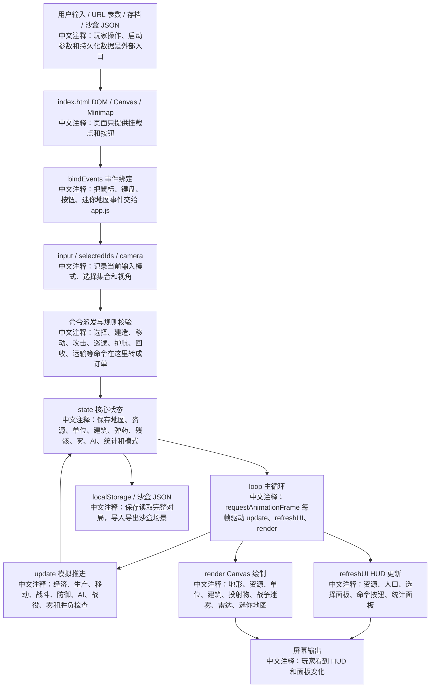
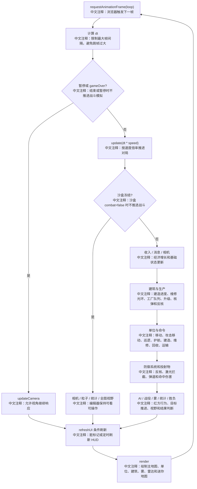
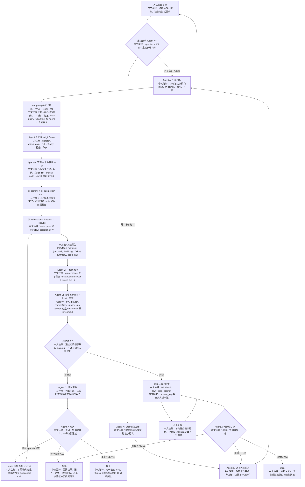
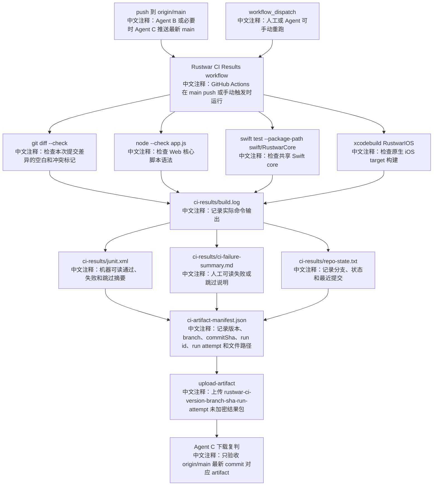

# 项目流程图

## 核心逻辑图

读图说明：从左到右看一次对局如何启动、接收输入、修改状态、推进模拟并输出画面。蓝图中的每个节点都对应当前 `app.js` 中的真实职责，不表示新架构。

## 每帧执行流

读图说明：这张图只描述 `loop(now)` 和 `update(dt)` 的执行顺序。排查性能、暂停、沙盒冻结、战斗结算问题时优先看它。

## 原生 iOS 迁移地基流程图

读图说明：这张图描述 v1.0 新增的原生 iOS 首屏链路。它只表示迁移地基，不表示 Web 版完整 RTS 已迁移完成。

```mermaid
flowchart TD
  P["RustwarCore MapPreset<br/>中文注释：三张地图的基础坐标、资源和初始单位建筑"] --> S["GameState<br/>中文注释：Swift 原生状态快照，包含资源、单位、建筑、残骸、金属和选择"]
  S --> E["GameEngine.update / select / issueMove / issueAttackMove / issuePatrol / issueGuard / issueRepair / issueReclaim / issueBuildExtractor / issueStop / issueAttack / queueUnit / cancelLastProduction / setRally / init(state)<br/>中文注释：推进收入 tick、点选、单单位移动、攻击移动、巡逻、护航、维修、回收、建造 Extractor、停止、基础攻击、炮塔防御开火、死亡残骸、工厂生产、生产取消、集结点、红方扩张/生产/进攻 AI 和存档状态恢复"]
  E --> C["GameController @Observable<br/>中文注释：持有 engine、camera、当前地图、HUD、暂停/速度、移动命令、攻击移动、护航、维修、回收、建造、生产、生产取消、集结点和 Save/Load 入口"]
  C --> H["SwiftUI RootGameView / GameHUDView<br/>中文注释：显示资源、收入、人口和选择反馈"]
  C --> TM["SwiftUI TacticalMapView<br/>中文注释：绘制资源、残骸、双方单位建筑和相机中心，并复用点位命令"]
  C --> B["SpriteView + BattlefieldScene<br/>中文注释：渲染地形、资源点、双方初始建筑、单位和移动目标"]
  T["SpatialTap / Drag / Magnify<br/>中文注释：iOS 触摸选择、移动落点、拖拽平移和捏合缩放"] --> C
  TT["TacticalMap DragTap<br/>中文注释：点按小地图换算世界坐标；等待点位、Builder 目标或实体目标命令时下令，否则居中相机"] --> C
  C --> M["UnitOrder.move<br/>中文注释：选中己方单位后写入移动目标"]
  M --> E
  C --> AM["UnitOrder.attackMove<br/>中文注释：选中己方单位后写入攻击移动目的地，core 在视野内临时索敌"]
  AM --> E
  C --> PT["UnitOrder.patrol<br/>中文注释：选中己方单位后写入巡逻两端点，core 在视野内临时索敌并在端点间往返"]
  PT --> E
  C --> GD["UnitOrder.guardTarget<br/>中文注释：选中己方单位后点选友方单位或建筑，core 在自身视野或被护航目标附近临时索敌并返回稳定偏移点"]
  GD --> E
  C --> REP["UnitOrder.repair<br/>中文注释：选中己方 Builder 后点选受损友方单位或建筑，core 靠近到 125 范围并按 18 HP/s 维修"]
  REP --> E
  C --> REC["UnitOrder.reclaim<br/>中文注释：选中己方 Builder 后点选残骸，core 靠近到 92 范围并把残骸金属转为己方金属"]
  REC --> E
  C --> BLD["UnitOrder.build<br/>中文注释：选中己方 Builder 后点选空闲资源点，core 扣金属、创建未完成 Extractor 并推进建造"]
  BLD --> E
  C --> STP["issueStop<br/>中文注释：选中己方单位后清除当前移动、攻击移动、巡逻、护航、维修、回收、建造或攻击订单"]
  STP --> E
  C --> A["UnitOrder.attack<br/>中文注释：选中己方单位后点选敌方目标，core 推进靠近、伤害和死亡清理"]
  A --> E
  C --> Q["ProductionQueueItem<br/>中文注释：选中己方陆军工厂后排队生产 Scout / Light Tank"]
  Q --> E
  C --> CQ["ProductionCancelResult<br/>中文注释：选中己方生产建筑后取消队尾生产并按未完成进度退款"]
  CQ --> E
  C --> RP["BuildingSnapshot.rally<br/>中文注释：选中己方生产建筑后设置后续出兵集结点"]
  RP --> E
  C --> PS["Pause / Speed Gate<br/>中文注释：暂停时不调用 update，运行时按 0.5x / 1x / 2x 缩放 deltaTime"]
  PS --> E
  C --> MP["Map Switch / Restart<br/>中文注释：重建 GameEngine、重置相机、清空待选命令并刷新地图渲染层"]
  MP --> E
  C --> SL["UserDefaults Save / Load<br/>中文注释：JSON 保存 GameState、CameraState、地图、暂停、速度和 AI 开关，读取后刷新原生状态"]
  SL --> E
  E --> TF["Turret Fire<br/>中文注释：完成状态炮塔自动攻击射程内敌方单位并进入冷却"]
  TF --> E
  E --> AI["Enemy AI<br/>中文注释：红方 Builder 扩张资源点，红方工厂排队造兵，空闲战斗单位获得攻击玩家目标的订单"]
  AI --> E
  C --> E
  B --> O["原生 iOS 战场画面<br/>中文注释：不是 WKWebView，不加载 index.html，显示血条、建造进度、残骸、移动线、攻击移动线、巡逻线、护航线、维修线、回收线、建造线、攻击目标线和红方行动"]
  H --> O
  TM --> O
```

## Agent 迭代流程图

读图说明：这张图描述后续开发管理流程。普通单轮仍可由人工直接召唤 Agent A/B/C；未来人工也可以用 `agentx:` 给 Agent X 一个总目标，由 Agent X 拆分轮次并循环调度 Agent A -> Agent B -> Agent C。无论是否由 Agent X 主控，每轮通过都必须基于 `origin/main` 最新 GitHub Actions artifact。

## CI 结果包流程图

读图说明：这张图只描述云端 workflow 如何生成 Agent C 可复判的 artifact。Web 原型仍无构建链；v1.0 起云端重验证除差异空白和 `app.js` 语法检查外，也记录 Swift package 与 iOS build 检查结果。未来可追加浏览器自动化报告。

