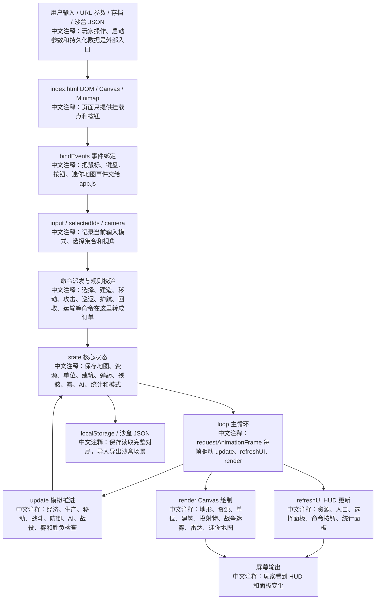
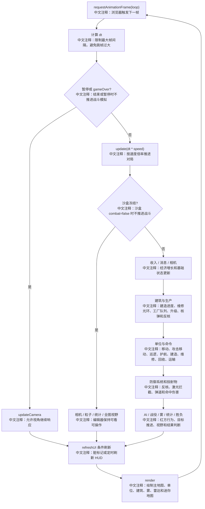
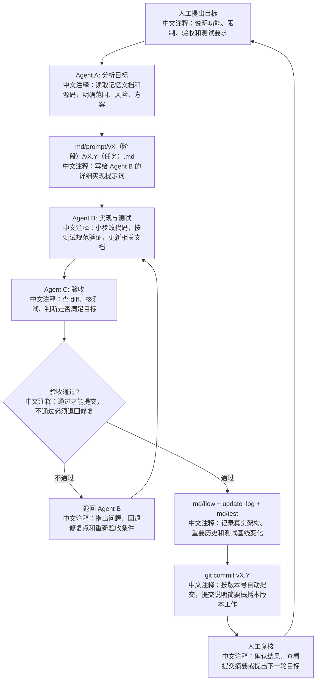

# 项目流程图

## 核心逻辑图

读图说明：从左到右看一次对局如何启动、接收输入、修改状态、推进模拟并输出画面。蓝图中的每个节点都对应当前 `app.js` 中的真实职责，不表示新架构。

## 每帧执行流

读图说明：这张图只描述 `loop(now)` 和 `update(dt)` 的执行顺序。排查性能、暂停、沙盒冻结、战斗结算问题时优先看它。

## Agent 迭代流程图

读图说明：这张图描述后续开发管理流程。人工先给目标，Agent A 只写实现提示词，Agent B 负责代码和测试，Agent C 负责验收；不通过就退回 Agent B，通过后更新核心文档并按版本号自动提交，最后回到人工复核。

